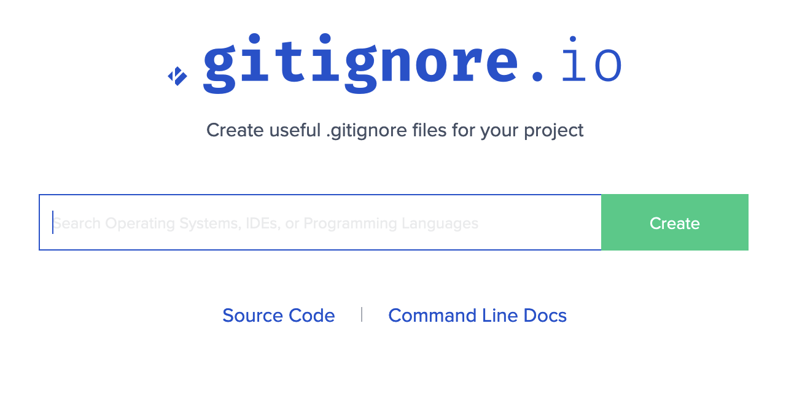

<!-- .slide: data-transition="slide" -->
# Gitignore

```sh
vendor
```
<!-- .element: class="fragment" -->

## Done! <!-- .element: class="fragment" -->

***

<!-- .slide: data-transition="slide" -->
# Hold up!

***

<!-- .slide: data-transition="slide" data-auto-animate -->
# Gitignore

```sh
vendor
```
<!-- .element: data-line-numbers data-id="gitignore" -->

***

<!-- .slide: data-transition="slide" data-auto-animate -->
# Gitignore

```sh
vendor
composer.lock
```
<!-- .element: data-line-numbers data-id="gitignore" -->

## Done! <!-- .element: class="fragment" -->

***

<!-- .slide: data-transition="slide" -->
# Seriously, hold up!

***

<!-- .slide: data-transition="slide" data-auto-animate -->
# Gitignore

```sh
vendor
composer.lock
```
<!-- .element: data-line-numbers data-id="gitignore" -->

***

<!-- .slide: data-transition="slide" data-auto-animate -->
# Gitignore

```sh
vendor
composer.lock
.DS_Store
Thumbs.db
```
<!-- .element: data-line-numbers data-id="gitignore" -->

***

<!-- .slide: data-transition="slide" data-auto-animate -->
# Gitignore

```sh
vendor
composer.lock
.DS_Store
Thumbs.db
# Linux?
```
<!-- .element: data-line-numbers data-id="gitignore" -->

***

<!-- .slide: data-transition="slide" data-auto-animate -->
# Gitignore

```sh
vendor
composer.lock
.DS_Store
Thumbs.db
# Linux?
# Other editors?
```
<!-- .element: data-line-numbers data-id="gitignore" -->

***

<!-- .slide: data-transition="slide-in fade-out" -->
# Gitignore

***

<!-- .slide: data-transition="fade-in slide-out" data-auto-animate -->
# Gitignore.io

 <!-- .element: class="fragment fade-up" style="width: 640px" -->

note: sets a theme of presentation: there are a lot of online tools to generate
or help you create these files

***

<!-- .slide: data-transition="slide" data-auto-animate -->
# Gitignore.io

```sh
# Created by https://www.toptal.com/developers/gitignore/api/linux,macos,phpunit,composer,intellij+all,php-cs-fixer,visualstudiocode
# Edit at https://www.toptal.com/developers/gitignore?templates=linux,macos,phpunit,composer,intellij+all,php-cs-fixer,visualstudiocode

### Composer ###
composer.phar
/vendor/

# Commit your application's lock file https://getcomposer.org/doc/01-basic-usage.md#commit-your-composer-lock-file-to-version-control
# You may choose to ignore a library lock file http://getcomposer.org/doc/02-libraries.md#lock-file
composer.lock

# ...
```

***

<!-- .slide: data-transition="slide" data-auto-animate -->
# Gitignore.io

## Downsides? <!-- .element: class="fragment" -->

200 line `.gitignore` files
<!-- .element: class="fragment" -->

***

<!-- .slide: data-transition="slide" -->
```sh
# Created by https://www.toptal.com/developers/gitignore/api/linux,macos,phpunit,composer,intellij+all,php-cs-fixer,visualstudiocode
# Edit at https://www.toptal.com/developers/gitignore?templates=linux,macos,phpunit,composer,intellij+all,php-cs-fixer,visualstudiocode

### Composer ###
composer.phar
/vendor/

# Commit your application's lock file https://getcomposer.org/doc/01-basic-usage.md#commit-your-composer-lock-file-to-version-control
# You may choose to ignore a library lock file http://getcomposer.org/doc/02-libraries.md#lock-file
composer.lock

# ...
```

## vs

```sh
vendor
composer.lock
.DS_Store
Thumbs.db
```
