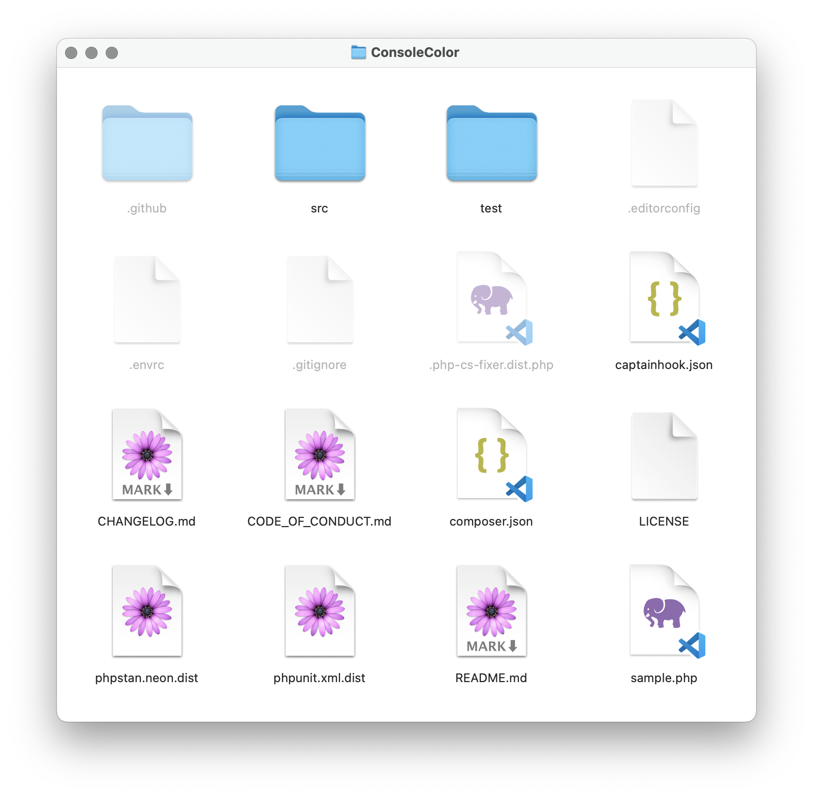
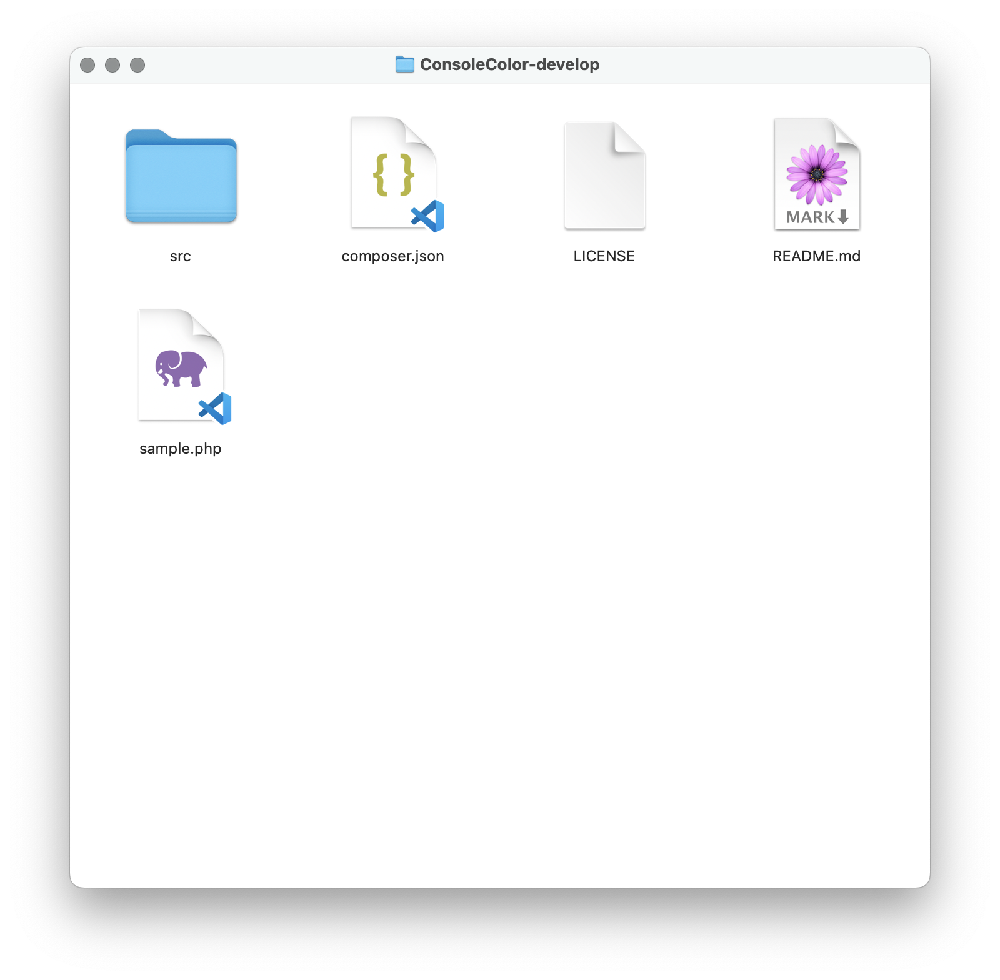

<!-- .slide: data-transition="slide" data-auto-animate -->
# Gitattributes

notes: it applies certain attributes or metadata to files for git

***

<!-- .slide: data-transition="slide" data-auto-animate -->
# Gitattributes

```sh
# .gitattributes

file-path    attribute
```

note: actually a lot of interesting features around changing git's handling of different files

***

<!-- .slide: data-transition="slide" data-auto-animate -->
# Gitattributes

```sh
# .gitattributes

file-path    export-ignore
```

An ignore file for your development files <!-- .element: class="fragment" -->

***

<!-- .slide: data-transition="slide-in fade-out" -->
# Gitattributes

 <!-- .element: style="max-height: 500px" -->

***

<!-- .slide: data-transition="fade-in slide-out" -->
# Gitattributes

 <!-- .element: style="max-height: 500px" -->
