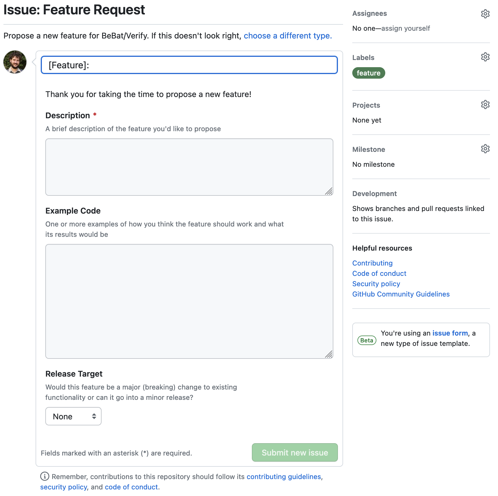

<!-- .slide: data-transition="slide" data-auto-animate -->
# Issue Templates

- <!-- .element: class="fragment" --> <code>.github/ISSUE_TEMPLATE/&lt;name&gt;.yml</code>
- <!-- .element: class="fragment" --> Help guide users to create useful issues for your project
- <!-- .element: class="fragment" --> Can also help categorize issues for you (bug report, feature request, question, etc)
- <!-- .element: class="fragment" --> Relatively simple <a href="https://docs.github.com/en/communities/using-templates-to-encourage-useful-issues-and-pull-requests/syntax-for-issue-forms">YAML schema</a>
- <!-- .element: class="fragment" --> Ultimately generates normal GitHub issues

note: relatively new beta feature of GitHub
previously could create markdown files that were used to pre-populate the issue form
new beta feature allows you to create issue forms via yaml

***

<!-- .slide: data-transition="slide" data-auto-animate -->
# Issue Templates

- Focus on key items for a particular issue <!-- .element: class="fragment" -->
- Give users freedom to explain their thoughts <!-- .element: class="fragment" -->
  - ...but make sure there are some guardrails <!-- .element: class="fragment" -->
- Sometimes less is more <!-- .element: class="fragment" -->
  - Don't create JIRA <!-- .element: class="fragment" -->

note: if you're creating a bug report form, what are the key items you need for a bug report?

***

<!-- .slide: data-transition="slide" data-auto-animate -->
# Issue Templates

```yaml [1-4|6-8|10-23|25-34]
name: Feature Request
description: Propose a new feature for BeBat/Verify
title: "[Feature]: "
labels: ["feature"]
body:
  - type: markdown
    attributes:
      value: Thank you for taking the time to propose a new feature!

  - type: textarea
    attributes:
      label: Description
      description: A brief description of the feature you'd like to propose
    validations:
      required: true

  - type: textarea
    attributes:
      label: Example Code
      description: |
        One or more examples of how you think the feature should work and what
        its results would be
      render: php

  - type: dropdown
    attributes:
      label: Release Target
      description: |
        Would this feature be a major (breaking) change to existing
        functionality or can it go into a minor release?
      options:
        - Unknown
        - Minor
        - Major
```

***

<!-- .slide: data-transition="slide" data-auto-animate -->
# Issue Templates


<!-- .element: class="r-stretch" -->

***

<!-- .slide: data-transition="slide" data-auto-animate -->
# Pull Request Templates

- <!-- .element: class="fragment" --> <code>.github/PULL_REQUEST_TEMPLATE.md</code>
- Guide developer through PR process <!-- .element: class="fragment" -->
- Use checklists to cover non-automated steps <!-- .element: class="fragment" -->
- Help contributors know what's expected of their PRs <!-- .element: class="fragment" -->

***

<!-- .slide: data-transition="slide" data-auto-animate -->
# Pull Request Templates

```markdown [1-2|4-13|15-25|27-32]
<!-- Please give this pull request a meaningful title that briefly
    summarizes its content -->

## Description

<!--
    Describe the contents of this change in as much detail as
    possible. Please include *why* this change is important and
    what benefit it provides.

    If this change relates to an open issue be sure to reference
    it here as well.
-->

## Contribution Checklist

- [ ] The contents of this pull request are my own work and may be
      distributed under the terms of the project license
- [ ] I have read and agree to the Contributing guidelines and the
      Code of Conduct
- [ ] All new changes are covered by tests
- [ ] All previous tests and checks are passing
- [ ] I have included documentation about this change
- [ ] The details of this change have been added to the
      `Unreleased` section of the CHANGELOG.md

**This pull request includes:**

- [ ] Breaking changes to existing functionality (major release)
- [ ] New functionality (minor release)
- [ ] Fixes for existing functionality (patch release)
- [ ] Fixes to an earlier major or minor release version
```
