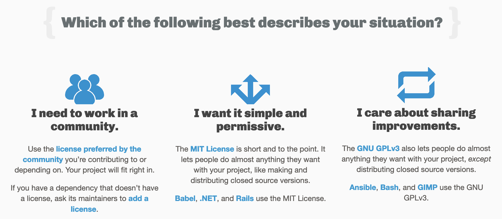

<!-- .slide: data-transition="slide" data-auto-animate -->
# License

<!-- .element: class="fragment" -->

***

<!-- .slide: data-transition="slide" data-auto-animate -->
# License

[Choose a License](https://choosealicense.com/) <!-- .element: class="fragment" -->

 <!-- .element: class="fragment" style="max-height: 300px"-->

***

<!-- .slide: data-transition="slide" data-auto-animate -->
# MIT License

- <!-- .element: class="fragment" --> Simple clear language
  - <!-- .element: class="fragment" --> ...for a legal document
- <!-- .element: class="fragment" --> Mandates items I personally care most about
  - <!-- .element: class="fragment" --> ...without limiting certain uses
- <!-- .element: class="fragment" --> Easy to spell
