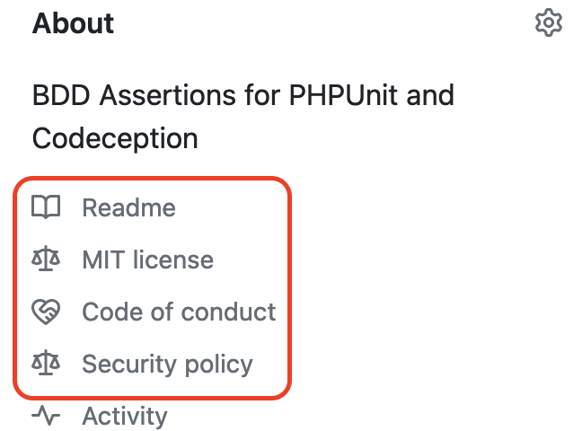
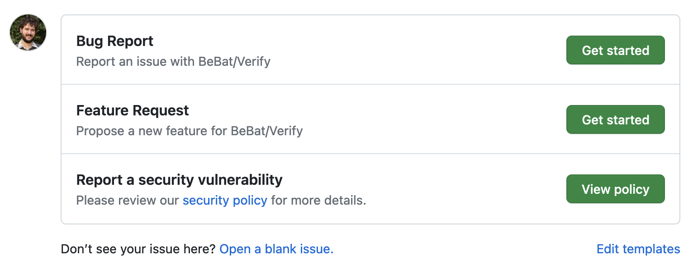
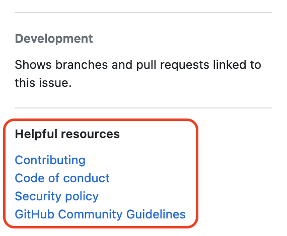
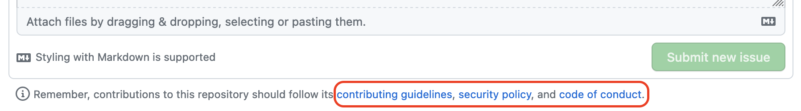

<!-- .slide: data-transition="slide" data-auto-animate -->
# Results

<!-- .element: class="r-stretch" -->

Adding these files change the way GitHub presents your project

***

<!-- .slide: data-transition="slide" data-auto-animate -->
# Results

<!-- .element: class="r-stretch" -->

Adding these files change the way GitHub presents your project

***

<!-- .slide: data-transition="slide" data-auto-animate -->
# Results

<!-- .element: class="r-stretch" -->

Adding these files change the way GitHub presents your project

***

<!-- .slide: data-transition="slide" data-auto-animate -->
# Results

<!-- .element: class="r-stretch" -->

Adding these files change the way GitHub presents your project

***

<!-- .slide: data-transition="slide" -->
## Where can I get all this?

- <!-- .element: class="fragment" --> <a href="https://github.com/bbatsche/php-project-template/">PHP Project Template</a>
  - <!-- .element: class="fragment" --> PHP library specific
  - <!-- .element: class="fragment" --> ...also Ben Batschelet specific

***

<!-- .slide: data-transition="slide" -->
## Where can I find out more about you?

- GitHub: [@bbatsche](https://github.com/bbatsche)
- Bluesky: [@bbatsche.bsky.social](https://bsky.app/profile/bbatsche.bsky.social)
- Mastodon: [@bbatsche@phpc.social](https://phpc.social/@bbatsche)
- LinkedIn: [@bbatsche](https://www.linkedin.com/in/bbatsche/)
